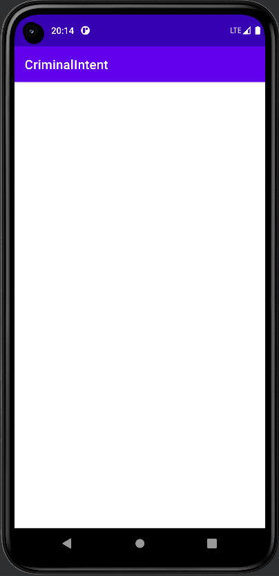
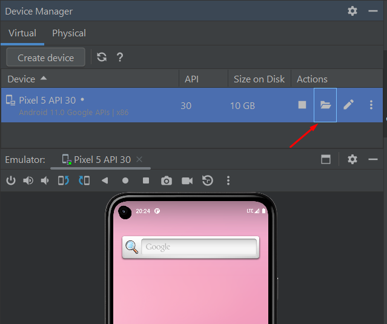
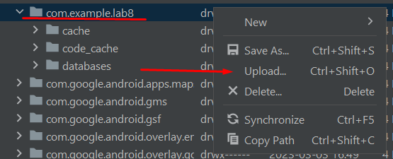
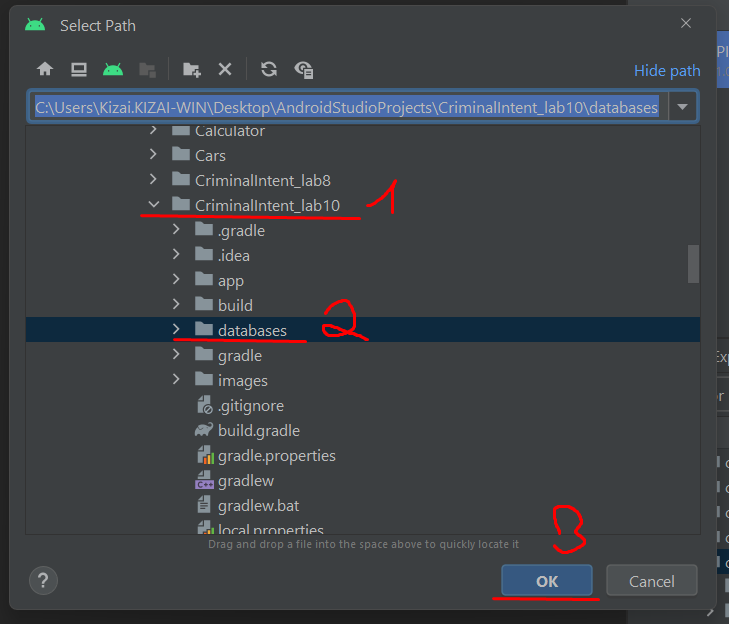
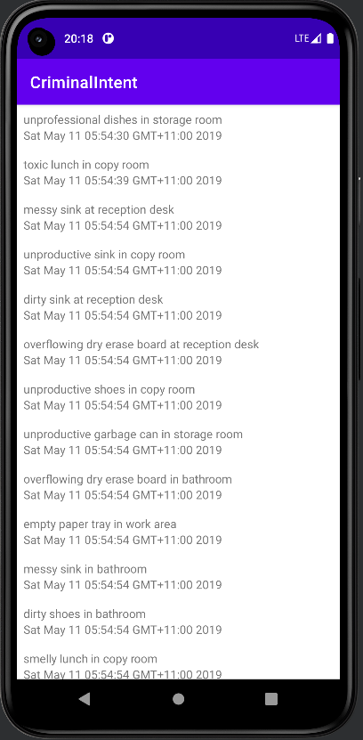

<p align = "center">Лабораторная работа №10<br>Базы данных и Room Library, навигация по фрагментам<br>01.03.02 Прикладная математика и информатика</p>
<br><br><br><br><br><br><br><br><br><br><br><br>
<p align = "right">Научный руководитель<br>
Соболев Евгений Игоревич</p>
<br><br><br>
<p align = "center">г. Южно-Сахалинск<br>2023 г.</p>

***
# <p align = "center">Оглавление</p>
- [Цели и задачи](#цели-и-задачи)
- [Решение задач](#решение-задач)
- [Проблема при клонировании с Git](#проблема)
- [Вывод](#вывод)

***

# <p align = "center">Цели и задачи</p>

Задачи:
Упражнение. Ошибка доступа к схеме
 Если вы посмотрите журналы сборки, вы увидите предупреждение о том, что ваше приложение не предоставляет каталог для экспорта схемы:
warning: Schema export directory is not provided to the annotation processor so we cannot export the schema. You can either provide `room.schemaLocation` annotation processor argument OR set exportSchema to false.
 Схема базы данных — это структура базы данных, а именно: какие таблицы в базе данных, какие столбцы в этих таблицах, а также любые ограничения и отношения между этими таблицами. Room поддерживает экспорт схемы базы данных в файл, чтобы ее можно было хранить в системе управления версиями. Экспорт схемы часто бывает полезен, чтобы иметь разные версии вашей базы данных. 
Предупреждение означает, что вы не указали местоположение файла, где Room мог бы сохранить схему базы данных. Вы можете указать местоположение схемы для аннотации @Database либо отключить экспорт, чтобы удалить предупреждение. Для данного упражнения можно выбрать один из этих вариантов. 
Чтобы указать место для экспорта, нужно указать путь для свойства обработчика аннотаций room.schemaLocation. Для этого добавьте блок kapt{} в файл app/build. gradle: 
... android { 
... buildTypes { 
... } 
kapt { 
arguments { 
arg("room.schemaLocation", "some/path/goes/here/") 
} 
} 
} ... 
Чтобы отключить экспорт, присвойте значение false свойству exportSchema: @Database(entities = [ Crime::class ], version=1, exportSchema = false) @TypeConverters(CrimeTypeConverters::class)
 abstract class CrimeDatabase : RoomDatabase() { abstract fun crimeDao(): CrimeDao }

Упражнение. Эффективная перезагрузка RecyclerView 
Сейчас, когда пользователь возвращается на экран списка после редактирования преступления, CrimeListFragment заново выводит все видимые преступления в RecyclerView. Это крайне неэффективно, так как в большинстве случаев изменяется всего одно преступление. Обновите реализацию RecyclerView в CrimeListFragment, чтобы заново выводилась только строка, связанная с измененным преступлением. Для этого обновите CrimeAdapter, чтобы расширить его до androidx.recyclingerview.widget. ListAdapter вместо RecyclerView.Adapter. ListAdapter — это RecyclerView.Adapter, который определяет разницу между текущим и новым набором данных и который вы задаете сами. Сравнение происходит в фоновом потоке, поэтому оно не замедляет работу пользовательского интерфейса. Адаптер ListAdapter, в свою очередь, дает команду утилизатору перерисовывать только измененные строки. В ListAdapter используется androidx.recyclingerview.widget.DiffUtil для определения того, какие части набора изменились. Чтобы закончить эту задачу, необходимо добавить реализацию DiffUtil.itemCallback в ваш ListAdapter. Вам также потребуется обновить CrimeListFragment, чтобы отправлять обновленный список преступлений в адаптер утилизатора, а не переназначать адаптер каждый раз, когда вы захотите обновить пользовательский интерфейс. Вы можете отправить новый список, вызвав функцию ListAdapter.submitList(MutableList?), или вы можете настроить LiveData и наблюдать за изменениями. (См. справку по API для androidx.recyclingerview.widget.DiffUtil и androidx. recyclingerview.widget.ListAdapter на developer.android.com/reference/kotlin для получения более подробной информации о том, как использовать эти инструменты.)

*** 

# <p align = "center">Решение</p>

`CrimeDatabase`
```kotlin
package com.example.lab8.database

import androidx.room.Database
import androidx.room.RoomDatabase
import androidx.room.TypeConverters
import com.example.lab8.Crime

@Database(entities = [ Crime::class ], version=1, exportSchema = false)
@TypeConverters(CrimeTypeConverters::class)
abstract class CrimeDatabase : RoomDatabase() {

    abstract fun crimeDao(): CrimeDao
}
```

`CrimeListFragment`
```kotlin
package com.example.lab8

import android.os.Bundle
import android.util.Log
import android.view.LayoutInflater
import android.view.View
import android.view.ViewGroup
import android.widget.TextView
import android.widget.Toast
import androidx.fragment.app.Fragment
import androidx.lifecycle.Observer
import androidx.lifecycle.ViewModelProviders
import androidx.recyclerview.widget.DiffUtil
import androidx.recyclerview.widget.LinearLayoutManager
import androidx.recyclerview.widget.ListAdapter
import androidx.recyclerview.widget.RecyclerView

private const val TAG = "CrimeListFragment"
class CrimeListFragment : Fragment() {
    private lateinit var crimeRecyclerView: RecyclerView
    private var adapter: CrimeAdapter? = CrimeAdapter(emptyList())

    private val crimeListViewModel: CrimeListViewModel by lazy {
        ViewModelProviders.of(this).get(CrimeListViewModel::class.java)
    }


    override fun onCreateView(
        inflater: LayoutInflater,
        container: ViewGroup?,
        savedInstanceState: Bundle?
    ): View? {
        val view = inflater.inflate(R.layout.fragment_crime_list, container, false)

        crimeRecyclerView =
            view.findViewById(R.id.crime_recycler_view) as RecyclerView
        crimeRecyclerView.layoutManager = LinearLayoutManager(context)

        crimeRecyclerView.adapter = adapter
        return view
    }

    private fun updateUI(crimes: List<Crime>) {
        adapter = CrimeAdapter(crimes)
        crimeRecyclerView.adapter = adapter
    }

    override fun onViewCreated(view: View, savedInstanceState: Bundle?) {
        super.onViewCreated(view, savedInstanceState)
        crimeListViewModel.crimeListLiveData.observe(
            viewLifecycleOwner,
            Observer { crimes ->
                crimes?.let {
                    Log.i(TAG, "Got crimes ${crimes.size}")
                    updateUI(crimes)
                }
            })
    }

    private inner class CrimeHolder(view: View)
        : RecyclerView.ViewHolder(view), View.OnClickListener{
        private lateinit var crime: Crime

        private val titleTextView: TextView = itemView.findViewById(R.id.crime_title)
        private val dateTextView: TextView = itemView.findViewById(R.id.crime_date)

        init {
            itemView.setOnClickListener(this)
        }

        fun bind(crime: Crime) {
            this.crime = crime
            titleTextView.text = this.crime.title
            dateTextView.text = this.crime.date.toString()
        }

        override fun onClick(v: View) {
            Toast.makeText(context, "${crime.title} pressed!", Toast.LENGTH_SHORT)
                .show()
        }
    }

    private inner class CrimeAdapter(var crimes: List<Crime>)
        : ListAdapter<Crime, CrimeHolder>(DiffUtilCallBack()) {
        override fun onCreateViewHolder(parent: ViewGroup, viewType: Int)
                : CrimeHolder {

            val view = layoutInflater.inflate(R.layout.list_item_crime, parent, false)
            return CrimeHolder(view)
        }

        override fun getItemCount() = crimes.size
        override fun onBindViewHolder(holder: CrimeHolder, position: Int) {
            val crime = crimes[position]
            holder.bind(crime)
        }
    }

    private inner class DiffUtilCallBack : DiffUtil.ItemCallback<Crime>() {

        override fun areContentsTheSame(oldItem: Crime, newItem: Crime): Boolean {
            return oldItem == newItem
        }

        override fun areItemsTheSame(oldItem: Crime, newItem: Crime): Boolean {
            return oldItem.id == newItem.id
        }
    }

    companion object {
        fun newInstance(): CrimeListFragment {
            return CrimeListFragment()
        }
    }
}
```

# <p align = "center">Проблема при клонировании с Git</p>

Проблема заключается в том, что при первом запуске не будет ничего отображаться
<p align = "center">
    
</p>

Для решения проблемы нам нужно загрузить базу данных:
1. Первым делом запускаем приложения и завершаем его работу, что бы оно было установлено на устройстве.

2. Далее открываем `Device File Explorer`. Это можно сделать через окно `Devise Manager`
<p align = "center">
    
</p>

3. Ищем наше приложение в списке по пути `data/data/com.example.lab8`. 
Это имя осталось после выполнения предыдущей лабораторной работы связанной с этим приложением.
<p align = "center">
    
</p>
Далее правым щелчком мы выбираем действия - `Upload...` 

Появится окно в котором нужно загрузить заранее заготовленную тестовую базу данных.
<p align = "center">
    
</p>

4. И последним шагом мы снова запускаем приложение, где должны будем увидеть это:
<p align = "center">
    
</p>

# <p align = "center">Вывод</p>
Я исправил ошибку доступа к схеме и изменил функцию, чтобы перезагружались не все данные, а только те, которые были подвержены изменению